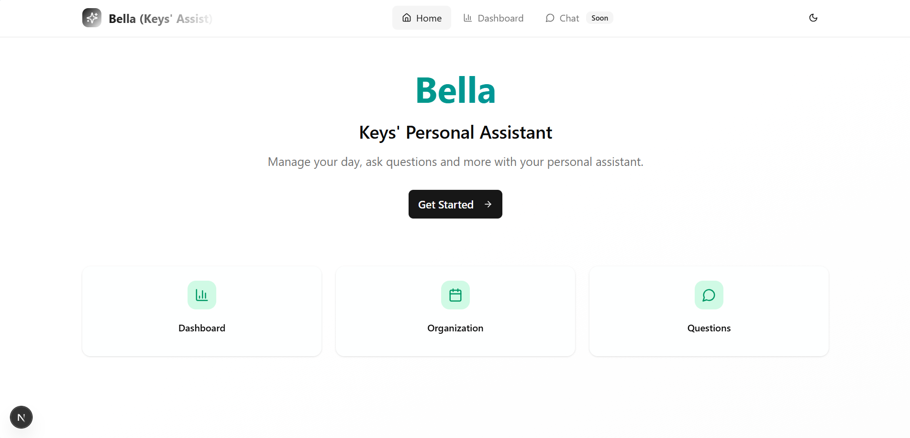
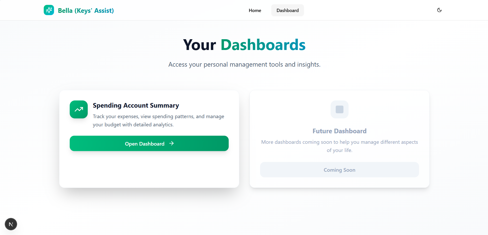
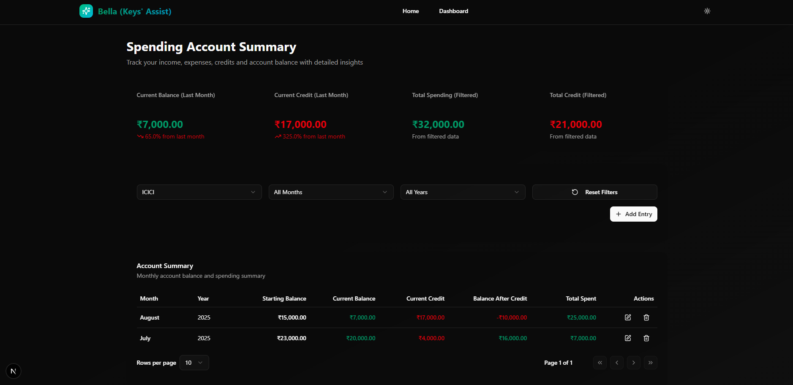

# Bella Keys Personal Assistant

Bella - Keys' (Shangar's) Personal Management.

- [Bella Keys Personal Assistant](#bella-keys-personal-assistant)
  - [App Screens](#app-screens)
    - [Home Screen](#home-screen)
    - [Dashboards](#dashboards)
    - [Spending Account Dashboard](#spending-account-dashboard)
  - [Expense Management Service](#expense-management-service)
    - [Technologies Used](#technologies-used)
    - [Features Overview](#features-overview)

The project handles the following responsibilities at the moment:

1. Expense Management Application

## App Screens

### Home Screen

### Dashboards

### Spending Account Dashboard

## Expense Management Service

### Technologies Used

1. Backend
   1. Built using **FastAPI**.
   2. Uses **SQLite** for data persistence.
   3. Follows **Clean Architecture** principles.
   4. Containerized with **Docker**.
2. Frontend
   1. Built using **Next.js** with **Bolt.diy** and **v0**.
   2. Containerized with **Docker**.

### Features Overview

- **Spending Account Expense Tracking**: Add, view, and manage expenses. Track monthly spending and credits. Gain preliminary insights into spending patterns.
- **Fully loaded FastAPI and Clean Architecture Codebase**: A robust starting point for building scalable and maintainable backend services using FastAPI and Clean Architecture principles. For more details, refer to the [Architecture Documentation](expense-manager-service/docs/architecture.md).
