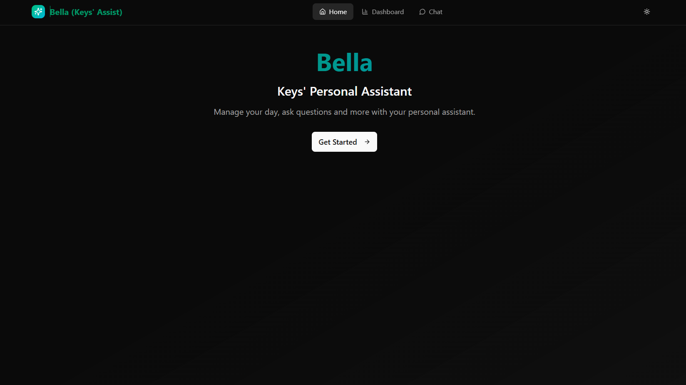
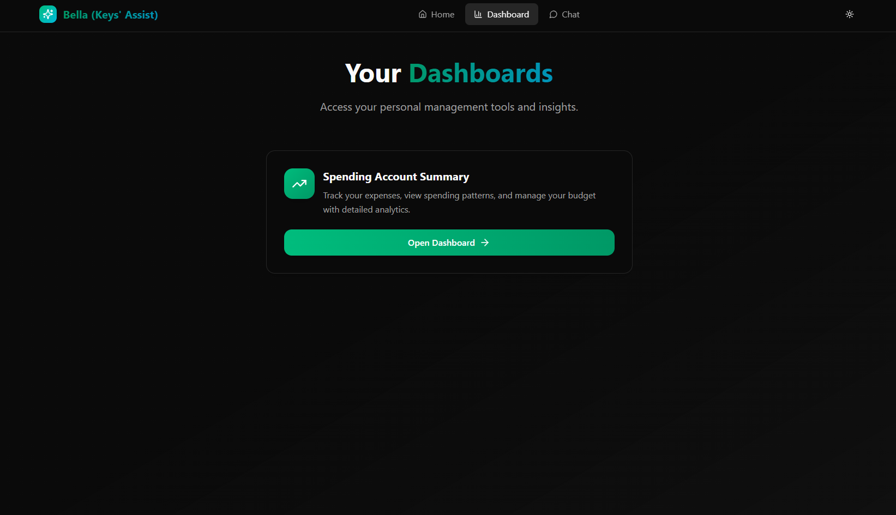
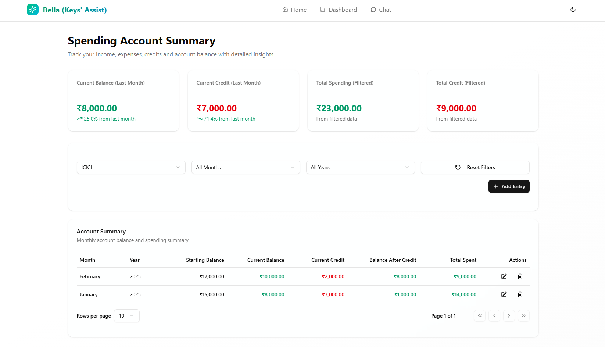
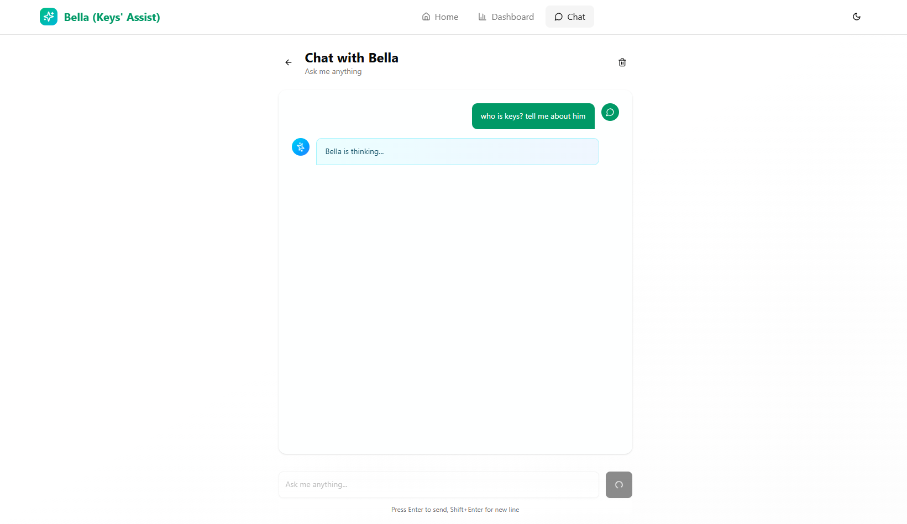
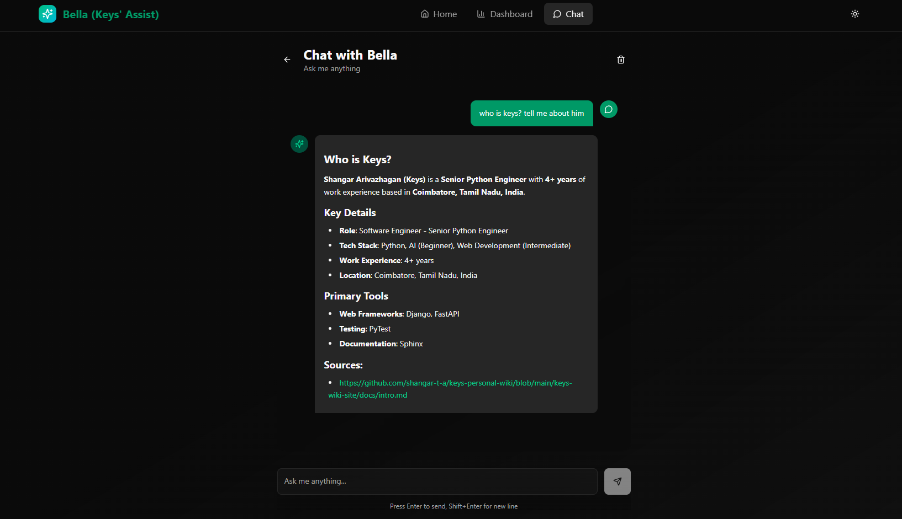
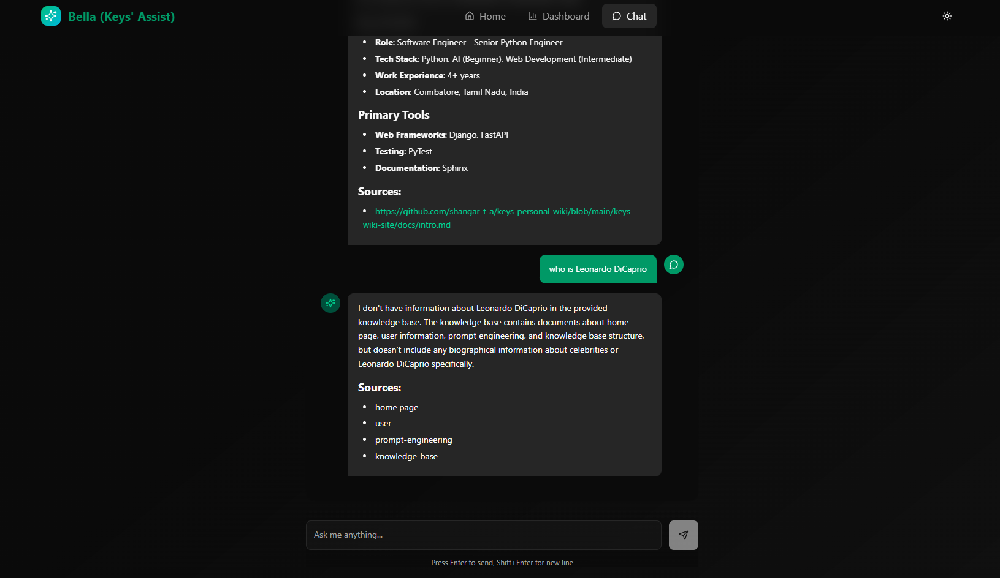

# Bella Keys Personal Assistant

Bella - Keys' (Shangar's) Personal Management.

- [Bella Keys Personal Assistant](#bella-keys-personal-assistant)
  - [2. App Screens](#2-app-screens)
    - [2.1. Home Screen](#21-home-screen)
    - [2.2. Dashboards](#22-dashboards)
    - [2.3. Spending Account Dashboard](#23-spending-account-dashboard)
    - [2.4. Bella Chatbot](#24-bella-chatbot)
      - [2.4.1. Chat Interface](#241-chat-interface)
      - [2.4.2. Chat With Bella (Answer available in Knowledge Base)](#242-chat-with-bella-answer-available-in-knowledge-base)
      - [2.4.3. Chat With Bella (Answer NOT available in Knowledge Base)](#243-chat-with-bella-answer-not-available-in-knowledge-base)
  - [3. Expense Management Service](#3-expense-management-service)
    - [3.1. Technologies Used](#31-technologies-used)
    - [3.2. Features Overview](#32-features-overview)
  - [4. Bella Chatbot](#4-bella-chatbot)
    - [4.1. Technologies Used](#41-technologies-used)
    - [4.2. Features Overview](#42-features-overview)

The project handles the following responsibilities at the moment:

1. Expense Management Application

## 2. App Screens

### 2.1. Home Screen

### 2.2. Dashboards

### 2.3. Spending Account Dashboard

### 2.4. Bella Chatbot

#### 2.4.1. Chat Interface

#### 2.4.2. Chat With Bella (Answer available in Knowledge Base)

#### 2.4.3. Chat With Bella (Answer NOT available in Knowledge Base)

## 3. Expense Management Service

### 3.1. Technologies Used

1. Backend
   1. Built using **FastAPI**.
   2. Uses **SQLite** for data persistence.
   3. Follows **Clean Architecture** principles.
   4. Containerized with **Docker**.
2. Frontend
   1. Built using **Next.js** with **Bolt.diy** and **v0**.
   2. Containerized with **Docker**.

### 3.2. Features Overview

- **Spending Account Expense Tracking**: Add, view, and manage expenses. Track monthly spending and credits. Gain preliminary insights into spending patterns.
- **Fully loaded FastAPI and Clean Architecture Codebase**: A robust starting point for building scalable and maintainable backend services using FastAPI and Clean Architecture principles. For more details, refer to the [Architecture Documentation](expense-manager-service/README.md).

## 4. Bella Chatbot

### 4.1. Technologies Used

1. Backend
   1. Built using **FastAPI**.
   2. Uses **LangChain** for abstractions.
   3. Supports both local and cloud-based LLMs. Tested with **Ollama** (local) and **Gemini** (Cloud - WIP).
   4. Custom abstractions for llms, embeddings, and vector stores.
      1. LLMs supported: Ollama, Gemini
      2. Embeddings supported: Ollama, HuggingFace
      3. Vector Stores supported: Qdrant
2. Tools: ETL Pipelines
   1. GitHub ETL Pipelines
      1. ETL for `keys-personal-assist` repo to extract knowledge base for Bella.
   2. Utilities
      1. Custom Logger
      2. Time Profiler

### 4.2. Features Overview

- **Knowledge Base Chatbot**: Chat with Bella using a knowledge base extracted from `keys-personal-assist` GitHub
  repository. Get relevant sources used to answer your questions.
- **LLM Integration**: Supports both local (Ollama) and cloud-based (Gemini) LLMs for generating responses.
- **Custom Abstractions**: Easily extendable abstractions for LLMs, and Embeddings. Vector Store is currently limited
  to Qdrant.
- **ETL Pipelines**: Extract, Transform, Load (ETL) pipelines to build and update the knowledge base from the GitHub
  repository. Supports extracting information from private repositories as well.
- **Utilities**: Custom logging and time profiling utilities to monitor and debug the application.
