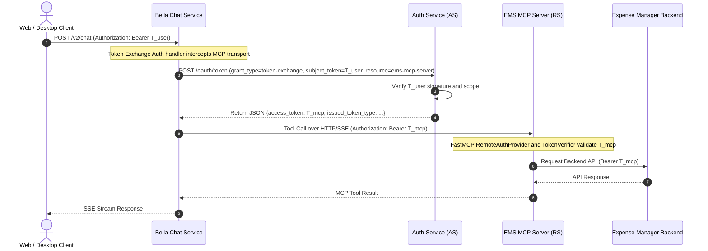

# Service-to-Service Delegation: RFC 8693 Token Exchange (OBO)

This document specifies the On-Behalf-Of (OBO) delegation flow implemented by Chat Service when invoking tools on an
MCP Server.

---

## 1. Architectural Requirement

During an AI Chat request execution:

1. Chat Service receives an HTTP request authenticated with a user access token (`T_user`) target-bounded to
   `aud: bella-chat-service`.
2. The AI Orchestrator selects an external tool (for example, `list_spending_entries`) provided by an MCP Server.
3. Forwarding `T_user` directly to the MCP Server violates RFC 8707 Resource Indicators and ambient authority
   principles.

To maintain zero-trust isolation, Chat Service executes an RFC 8693 OAuth 2.0 Token Exchange request with the
Authorization Server.

---

## 2. Sequence Diagram and Call Flow



---

## 3. Token Structure Comparison

### Original User Access Token (`T_user`)

```json
{
  "iss": "http://localhost:8002",
  "sub": "shangar",
  "aud": "http://localhost:8000",
  "client_id": "keys-personal-assist-ui",
  "scope": "openid profile email bella-chat:write bella-ems:read",
  "role": "user"
}
```

### Exchanged MCP Access Token (`T_mcp`)

```json
{
  "iss": "http://localhost:8002",
  "sub": "shangar",
  "aud": "http://localhost:8001/mcp",
  "client_id": "bella-chat-service",
  "scope": "openid profile email bella-chat:write bella-ems:read",
  "role": "user",
  "act": {
    "sub": "bella-chat-service"
  }
}
```

---

## 4. Implementation Details

### Chat Service Client Token Handler (`OBOTokenAuth`)

In Chat Service, an On-Behalf-Of transport authentication handler intercepts outgoing HTTP calls to MCP endpoints. It
reads the active user token context, executes a token exchange request against the Authorization Server token endpoint,
and caches exchanged tokens keyed by `(subject_token, resource)` to minimize latency.

### MCP Server Authorization Context

In MCP Server:

* Request authentication relies on native FastMCP token verifiers and remote authorization provider configuration.
* The server validates the `T_mcp` JWT signature and verifies that the `aud` claim matches the MCP server resource URI.
* MCP tools retrieve caller credentials directly from the native FastMCP authentication context.
