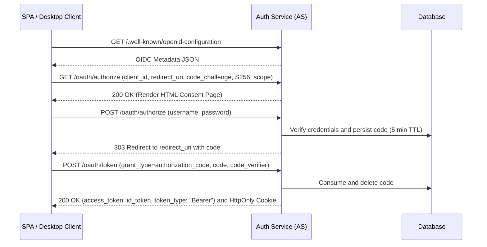

# OAuth 2.1 and OpenID Connect (OIDC) Core Specification

This document details the OAuth 2.1 authorization code flow, OpenID Connect 1.0 integration, and client session
mechanics implemented by the central Authorization Server.

---

## 1. Compliance Standards

The central Authorization Server acts as the Identity Provider (IdP) and Authorization Server (AS):

1. **OAuth 2.1 Redirection Flow**: Mandates `GET /oauth/authorize` with PKCE `S256` SHA-256 validation. Implicit
   grant and resource owner password credentials grants are unsupported.
2. **Metadata Discovery ([RFC 8414](https://datatracker.ietf.org/doc/html/rfc8414))**: Served at
   `/.well-known/oauth-authorization-server` and `/.well-known/openid-configuration`.
3. **OpenID Connect Core 1.0**: Returns an `id_token` JWT alongside the `access_token` when the `openid` scope is
   requested. Exposes standard user profile claims at `GET /oauth/userinfo`.
4. **Database-Backed Code Store**: Authorization codes are stored in the database with single-use replay
   consumption.

---

## 2. API Endpoints Reference

### Discovery Metadata

* `GET /.well-known/openid-configuration`
* `GET /.well-known/oauth-authorization-server`

### Authorization and Token Endpoints

* `GET /oauth/authorize`: Renders HTML login and scope consent interface.
* `POST /oauth/authorize`: Authenticates credentials and redirects with a short-lived authorization code.
* `POST /oauth/token`: Exchanges code and PKCE verifier for `access_token` and optional `id_token`.
* `GET /oauth/userinfo`: Returns subject profile claims (`sub`, `role`) for valid Bearer tokens.
* `POST /logout`: Invalidates the `refresh_token` session cookie.

---

## 3. Client Session and Token Storage Architecture

To mitigate Cross-Site Scripting (XSS) and token exfiltration risks:

1. **In-Memory Access Tokens**: Web SPA clients hold access tokens strictly in volatile application memory. Access
   tokens are not stored in `localStorage` or `sessionStorage`.
2. **HttpOnly Refresh Cookies**: Long-lived `refresh_token` cookies are configured with `HttpOnly`, `Secure`, and
   `SameSite=Lax`.
3. **PKCE Storage**: Temporary `code_verifier` strings are saved in browser storage during redirect navigation and
   cleared immediately following the token exchange request.
4. **Desktop Protocol (`bella-app://`)**: Electron desktop applications initiate authentication via the system default
   browser, redirecting to the `bella-app://callback` custom protocol handler.
