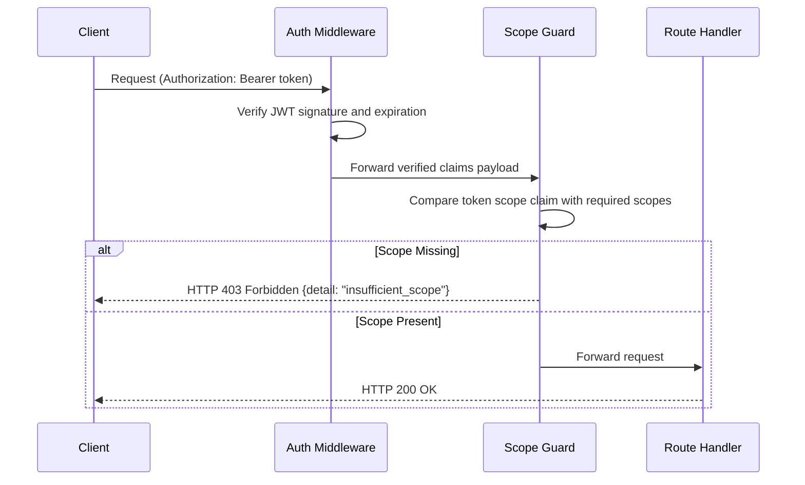

# Scopes, Roles and Scope Guard Enforcement

This document specifies the Role-Based Access Control (RBAC) and scope enforcement mechanics used across Bella Keys
services.

---

## 1. Roles versus Scopes

* **Roles (`role`)**: Axis of user identity defined on the primary user record (`user` or `admin`). Embedded in the
  `role` claim of the JWT. Controls who can act in the system.
* **Scopes (`scope`)**: Permission boundaries formatted as `<service>:<action>`. Embedded in the space-separated
  `scope` claim of the access token. Controls what the token is permitted to execute against resource endpoints.

---

## 2. Scope Registry

Central scope definitions are managed by the Authorization Server and embedded in token payloads during authorization.

### Registered Scope Set

| Scope String | Target Service | Meaning |
| --- | --- | --- |
| `openid` | Auth Service | Triggers OIDC ID token generation and OIDC discovery |
| `profile` | Auth Service | Allows reading basic profile claims |
| `email` | Auth Service | Allows reading email address claims |
| `bella-ems:read` | Expense Manager Service | Read-only access to accounts, periods, entries, assets, liabilities, and wealth summaries |
| `bella-ems:write` | Expense Manager Service | Write access (create, edit, delete) to EMS resources |
| `bella-chat:read` | Bella Chat Service | Read access to chat history and sessions |
| `bella-chat:write` | Bella Chat Service | Send messages and execute agent streams |

### Per-Client Scope Filtering

Each registered client ID is restricted to a maximum allowed scope set during token issuance:

```json
{
  "keys-personal-assist-ui": [
    "openid", "profile", "email",
    "bella-ems:read", "bella-ems:write",
    "bella-chat:read", "bella-chat:write"
  ],
  "ems-mcp-server": [
    "bella-ems:read", "bella-ems:write"
  ],
  "bella-chat-service": [
    "bella-chat:read", "bella-chat:write", "bella-ems:read"
  ]
}
```

---

## 3. Scope Guard Enforcement Architecture

Resource services enforce scopes using a centralized scope guard dependency.

```python
# Conceptual route scope guard example
router.include_router(account_router, dependencies=[require_scope("bella-ems:read")])
```

### Scope Guard Evaluation Flow


