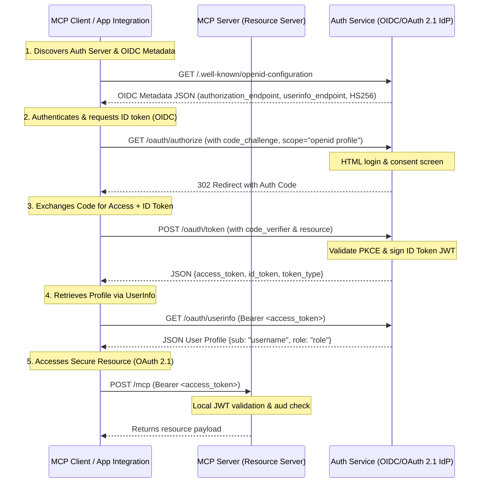

# Identity & Authorization Architecture (OIDC + OAuth 2.1)

This document details the transport-level authentication and authorization system implemented in the Bella Keys services.

---

## 1. Compliance Architecture

Our Identity Provider (IdP) supports unified standards:
1. **OAuth 2.1 & OIDC as Primary**: The React SPA client (Web UI) and all integrations (like the MCP server) authenticate via the standard Redirection Flow (`/oauth/authorize` with PKCE `S256` validation).
2. **Legacy/Direct Endpoints**: Direct credentials login (`/login`) is maintained only for direct backend script integrations or legacy compatibility.
3. **Cookie-Based Silent Token Refresh**: Session rotation is maintained via `/refresh` consuming HttpOnly cookies to keep UI sessions alive securely.



### Supported RFC & OIDC Standards

1. **OpenID Connect Core 1.0**:
   - Returns a standard ID Token (`id_token`) as a signed JWT alongside the `access_token` when the `openid` scope is requested.
   - Exposes a standard OIDC **UserInfo Endpoint** at `/oauth/userinfo` for reading user profile attributes.
2. **OAuth 2.0 Authorization Server Metadata ([RFC 8414](https://datatracker.ietf.org/doc/html/rfc8414))**:
   - Exposes configuration at `/.well-known/oauth-authorization-server` and `/.well-known/openid-configuration`.
3. **PKCE Protection ([RFC 7636](https://datatracker.ietf.org/doc/html/rfc7636))**:
   - Mitigates authorization code interception using mandatory `S256` SHA-256 validation.
4. **Resource Indicators ([RFC 8707](https://www.rfc-editor.org/rfc/rfc8707.html))**:
   - Binds the issued access token to a specific resource identifier audience (`aud`), checked locally by resource servers (MCP).
5. **Exact Redirection URI Matching**:
   - Avoids open redirector vulnerabilities by strictly enforcing exact string matching for all redirect URIs (no dynamic port mapping, no wildcards).
6. **DB-Backed State**:
   - Authorization codes are stored in PostgreSQL (`oauth_authorization_codes`) instead of in-memory maps to prevent replay attacks and support multiple Auth Service instances.

---


## 2. API Reference

### Identity Provider Endpoints (`auth-service` on port `8002`)
* `GET /.well-known/openid-configuration`: Returns OIDC metadata discovery JSON.
* `GET /oauth/authorize`: Renders the HTML login/consent screen.
* `POST /oauth/authorize`: Authenticates credentials and issues code.
* `POST /oauth/token`: Exchanges code + PKCE verifier for `access_token` and `id_token`.
* `GET /oauth/userinfo`: Returns subject and role details using the bearer token.
* `POST /login`: Retained legacy password credentials flow for the SPA react/electron app.

### Resource Server Validation (`ems-mcp-server` on port `8001`)
* Evaluates incoming requests locally using JWT signatures.
* Verifies that the audience (`aud`) matches `BASE_URL` to block token reuse.

---

## 3. Developer Verification

### Verify Discovery Metadata
```bash
curl -s http://localhost:8002/.well-known/openid-configuration | json_pp
```

### Fetch User Profile from UserInfo
```bash
curl -H "Authorization: Bearer <access_token>" http://localhost:8002/oauth/userinfo
```
