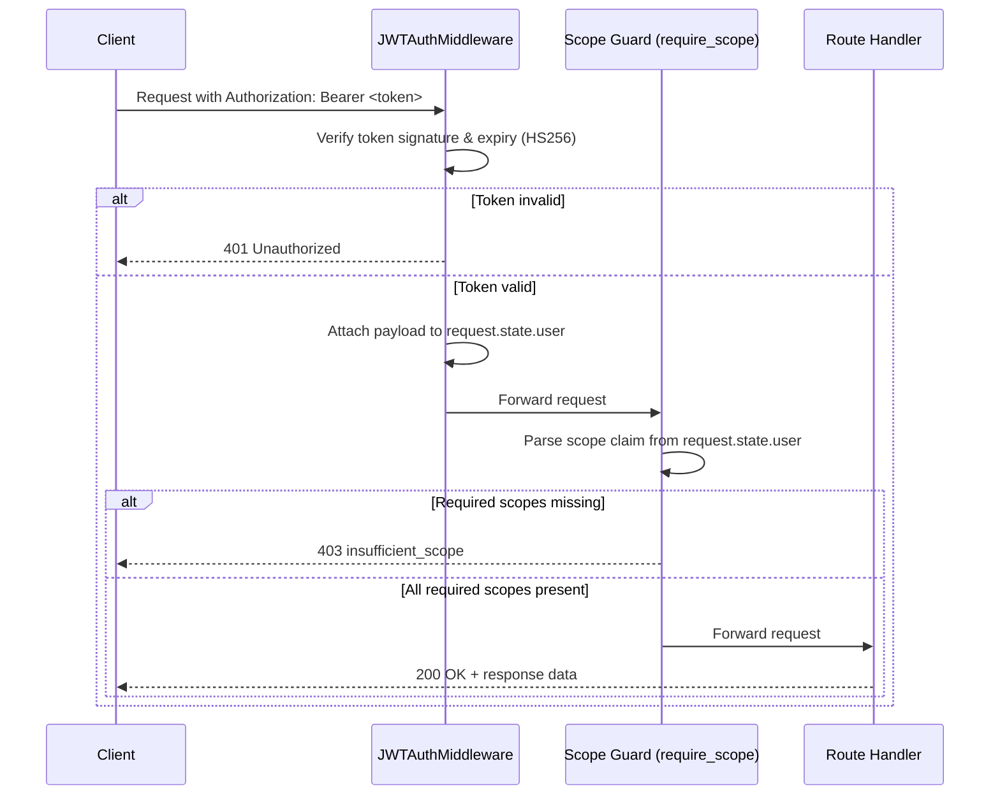

# Identity & Authorization Architecture (OIDC + OAuth 2.1)

This document details the transport-level authentication and authorization system implemented in the Bella Keys services.

---

## 1. Compliance Architecture

Our Identity Provider (IdP) supports unified standards:

1. **OAuth 2.1 & OIDC as Primary**: The React SPA client (Web UI) and all integrations (like the MCP server) authenticate via the standard Redirection Flow (`/oauth/authorize` with PKCE `S256` validation).
2. **Legacy/Direct Endpoints**: Direct credentials login (`/login`) is maintained only for direct backend script integrations or legacy compatibility.
3. **Cookie-Based Silent Token Refresh**: Session rotation is maintained via `/refresh` consuming HttpOnly cookies to keep UI sessions alive securely.


### Supported RFC & OIDC Standards

1. **OpenID Connect Core 1.0**:
   - Returns a standard ID Token (`id_token`) as a signed JWT alongside the `access_token` when the `openid` scope is requested.
   - Exposes a standard OIDC **UserInfo Endpoint** at `/oauth/userinfo` for reading user profile attributes.
2. **OAuth 2.0 Authorization Server Metadata ([RFC 8414](https://datatracker.ietf.org/doc/html/rfc8414))**:
   - Exposes configuration at `/.well-known/oauth-authorization-server` and `/.well-known/openid-configuration`.
3. **PKCE Protection ([RFC 7636](https://datatracker.ietf.org/doc/html/rfc7636))**:
   - Mitigates authorization code interception using mandatory `S256` SHA-256 validation.
4. **Resource Indicators ([RFC 8707](https://www.rfc-editor.org/rfc/rfc8707.html))**:
   - Binds the issued access token to a specific resource identifier audience (`aud`), checked locally by resource servers (MCP).
5. **Exact Redirection URI Matching**:
   - Avoids open redirector vulnerabilities by strictly enforcing exact string matching for all redirect URIs (no dynamic port mapping, no wildcards).
6. **DB-Backed State**:
   - Authorization codes are stored in PostgreSQL (`oauth_authorization_codes`) instead of in-memory maps to prevent replay attacks and support multiple Auth Service instances.

---

## 2. API Reference

### Identity Provider Endpoints (`auth-service` on port `8002`)

- `GET /.well-known/openid-configuration`: Returns OIDC metadata discovery JSON.
- `GET /oauth/authorize`: Renders the HTML login/consent screen.
- `POST /oauth/authorize`: Authenticates credentials and issues code.
- `POST /oauth/token`: Exchanges code + PKCE verifier for `access_token` and `id_token`.
- `GET /oauth/userinfo`: Returns subject and role details using the bearer token.
- `POST /login`: [DEPRECATED] Retained legacy password credentials flow for the SPA react/electron app. Use the `/oauth/authorize` flow instead.
- `POST /logout`: Clears the HttpOnly `refresh_token` session cookie.

### Resource Server Validation (`ems-mcp-server` on port `8001`)

- Evaluates incoming requests locally using JWT signatures.

- Verifies that the audience (`aud`) matches `BASE_URL` to block token reuse.

---

## 3. Developer Verification

### Verify Discovery Metadata

```bash
curl -s http://localhost:8002/.well-known/openid-configuration | json_pp
```

### Fetch User Profile from UserInfo

```bash
curl -H "Authorization: Bearer <access_token>" http://localhost:8002/oauth/userinfo
```

---

## 4. SPA Client Session & Storage Strategy

To ensure robust security and defense against Cross-Site Scripting (XSS) and token theft:

1. **In-Memory Access Tokens**:
   - The React SPA client never stores the `access_token` in `localStorage` or `sessionStorage`. Instead, it is held strictly in JavaScript memory (`tokenStore.ts`).
2. **HttpOnly Refresh Cookies**:
   - The long-lived `refresh_token` is stored as an `HttpOnly`, `Secure` (where applicable), and `SameSite=Lax` cookie. This makes it inaccessible to client-side scripts, protecting it from theft.
3. **PKCE Temporary Verifier**:
   - During the redirect flow, the generated plaintext `code_verifier` is stored in `localStorage` under `pkce_code_verifier`.
   - Once the user is redirected back to the `/callback` page, the client retrieves this verifier, executes the POST exchange to `/oauth/token`, and then immediately clears it from `localStorage`.
4. **Token Rotation (Silent Refresh)**:
   - When the access token expires (or on app mount), the client silently sends a `POST /refresh` request.
   - The browser automatically transmits the `refresh_token` cookie, returning a new access token and setting a rotated refresh cookie. If refresh validation fails, a logout is triggered.
5. **Electron Desktop Deep-Linking (Custom Protocol)**:
   - When running in the Electron desktop wrapper, the login process starts by opening the authorization URL in the user's default external web browser (via `window.open` triggering Electron's `setWindowOpenHandler` calling `shell.openExternal`).
   - The redirect URI is set to the custom protocol `bella-app://callback`.
   - The desktop app registers this protocol with the OS on startup using `app.setAsDefaultProtocolClient('bella-app')`.
   - Once authorized, the system browser redirects to the custom protocol URL, triggering the app's `open-url` (macOS) or `second-instance` (Windows/Linux) listeners.
   - The main process sends this URL to the React frontend via IPC (`oauth-callback` event), which parses the code and state, and navigates to the callback page to finalize login.

---

## 5. Scopes, Roles & Token Anatomy

### Roles

Roles are set at account creation time and stored on the `users` table (`role` column). Every issued JWT embeds the user's role in the `role` claim. Roles control **who** can act in the system.

| Role | Description |
|---|---|
| `user` | Default role for all authenticated users. Full access to their own data. |
| `admin` | Reserved for future admin tooling. Not used by any route today. |

Roles are **not** scope-equivalents. A `user` can hold any granted scope; roles exist as a separate authorization axis for future RBAC expansion.

---

### Scopes

Scopes control **what** the token is permitted to do against a specific resource service. They follow the `<bella-service>:<action>` naming convention and are registered in `services/auth-service/app/core/scopes.py`.

#### Registered Scope Set

| Scope | Service | Meaning |
|---|---|---|
| `openid` | Auth Service (OIDC) | Include identity claims; triggers ID token issuance |
| `profile` | Auth Service (OIDC) | Read the user's name and profile claims |
| `email` | Auth Service (OIDC) | Read the user's email address |
| `bella-ems:read` | Expense Manager Service | Read-only access to all EMS resources (accounts, entries, periods, assets, liabilities, wealth) |
| `bella-ems:write` | Expense Manager Service | Write access to EMS resources (create, update, delete) |
| `bella-chat:read` | Bella Chat Service | Read-only access to chat resources (history, sessions) |
| `bella-chat:write` | Bella Chat Service | Send messages and manage chat sessions on behalf of the user |

> `bella-ems:write` and `bella-chat:write` cover create, update, and delete — matching the GitHub/Stripe convention. There is no separate `:delete` scope.

#### Per-Client Allowed Scopes

Each registered client is limited to a maximum set of scopes defined in `CLIENT_ALLOWED_SCOPES` in `scopes.py`. The auth server silently drops any requested scope outside this set before issuing the authorization code.

| Client | Allowed Scopes |
|---|---|
| `keys-personal-assist-ui` | All scopes (openid, profile, email, bella-ems:read/write, bella-chat:read/write) |
| `ems-mcp-server` | bella-ems:read, bella-ems:write |

#### How Scopes Are Granted

Scopes are **not stored in the database**. They flow through the authorization code record and are embedded as a space-separated string in the `scope` claim of the issued JWT.

1. Client requests scopes via the `scope` query parameter on `/oauth/authorize`.
2. Auth server intersects requested scopes with the client's allowed set (`filter_scopes()`).
3. The filtered scope string is stored in the `oauth_authorization_codes` DB record.
4. At `/oauth/token`, the scope string from the code record is embedded directly into the JWT.

---

### JWT Token Anatomy

Every access token issued by the auth service is a signed HS256 JWT with the following claims:

| Claim | Type | Description |
|---|---|---|
| `iss` | string | Issuer — the base URL of the auth service (e.g. `http://localhost:8002`) |
| `sub` | string | Subject — the authenticated username |
| `aud` | string | Audience — the target resource server URL (e.g. `http://localhost:8001`) |
| `iat` | integer | Issued At — Unix timestamp of token creation |
| `nbf` | integer | Not Before — Unix timestamp before which the token is invalid |
| `jti` | string | JWT ID — unique hex UUID for this token (prevents replay) |
| `scope` | string | Space-separated list of granted scopes |
| `role` | string | User role (`user` or `admin`) |
| `client_id` | string | The OAuth client that initiated the authorization |

---

### Scope Enforcement Flow



---

### Adding Scopes for New Services

To add scopes for a new resource service:

1. Add the scope strings to `VALID_SCOPES` in `services/auth-service/app/core/scopes.py`.
2. Add the client allowed scope entries to `CLIENT_ALLOWED_SCOPES`.
3. Create a `scope_guard` dependency in the new service's router using `require_scope()` from `utilities.scope_guard`.
4. Update `scopes_supported` in the `/.well-known` metadata — this is automatic since it reads from `VALID_SCOPES`.
5. Update this document and the user-facing `authentication-guide.md` with the new scope description.
