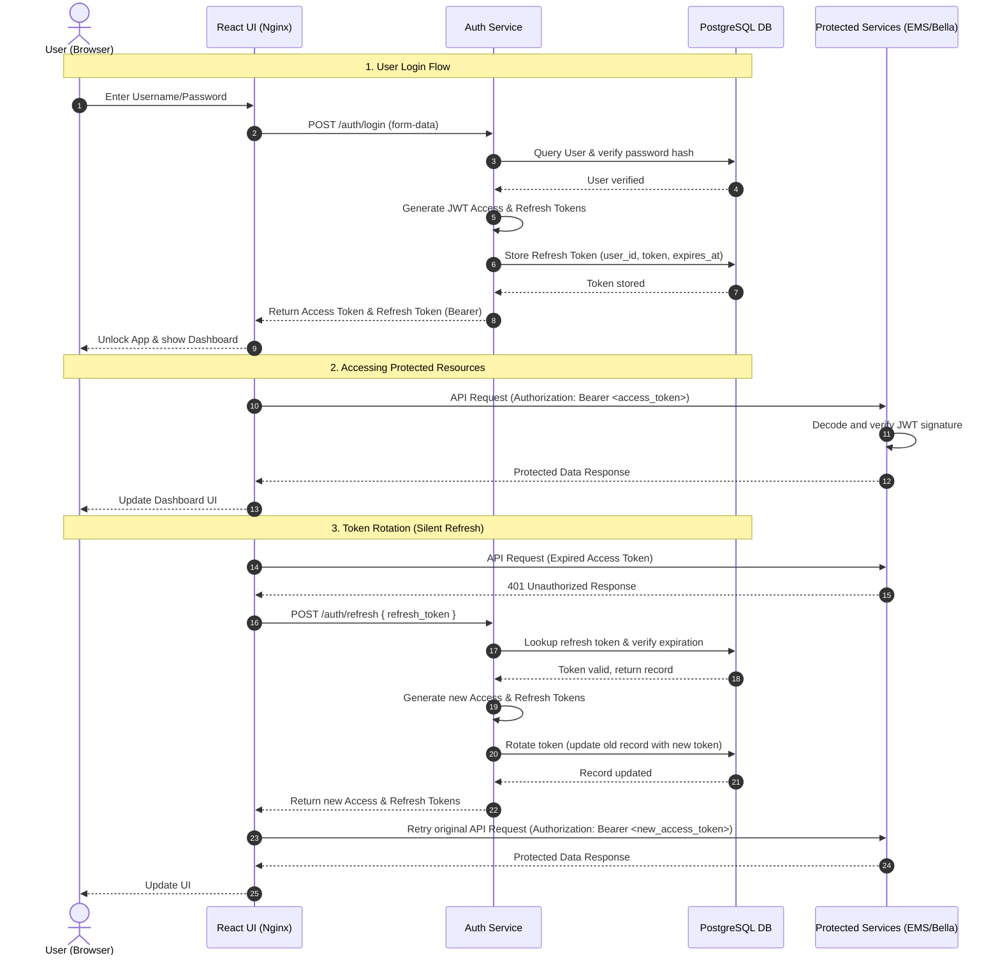

# Authentication Guide

Bella Keys uses a local authentication system designed to keep your data secure on your own device. When you step away, your personal assistant remains locked and protected.

## Logging In

1. Open Bella Keys.
2. At the **Lock Screen**, enter your Master Username and Password.
3. Click **Unlock**.

*Note: Your credentials are only stored locally on your machine. They are never sent to a cloud server.*

## Session Security & Timeouts

To ensure your data remains secure:

- **Automatic Lock:** Your active session securely expires after **1 hour** of inactivity.
- **Silent Refresh:** If you are actively using the application, Bella Keys will silently refresh your session in the background so you are not repeatedly asked for your password.
- **Full Expiration:** If the app is closed or inactive for **7 days**, your background session token fully expires. On your next visit, you will need to log in again.

## Locking the App Manually

If you need to leave your computer and want to secure Bella Keys immediately:

1. Locate the sidebar menu.
2. Click **Lock App**.
3. You will immediately be returned to the Lock Screen, requiring a password for the next access.

## Authentication Flow Diagram

The sequence diagram below illustrates the authentication lifecycle, including initial login, accessing resources, and token rotation (silent refresh):

