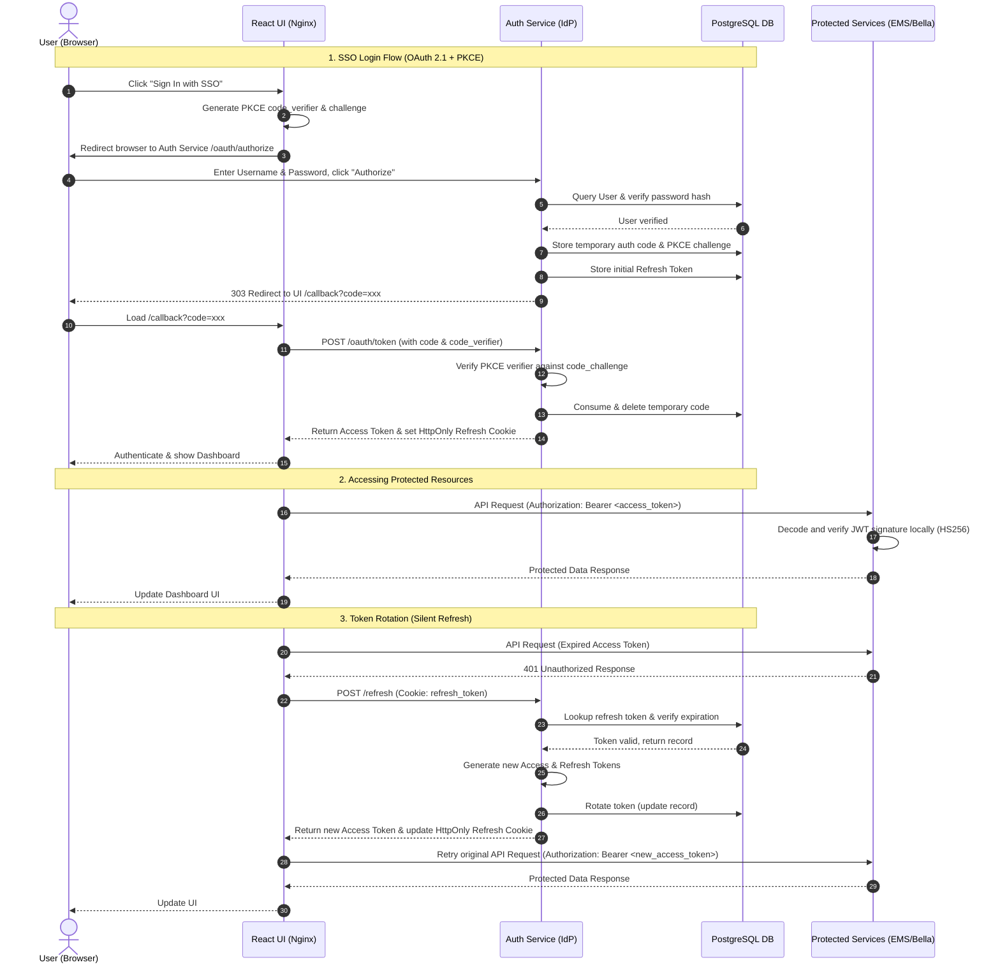

# Authentication Guide

Bella Keys uses a centralized Single Sign-On (SSO) authentication system designed to keep your data secure on your own device. When you log out, your personal assistant session is terminated and remains protected.

## Logging In

1. Open Bella Keys.
2. At the **Login Screen**, click **Sign In with SSO**.
3. You will be redirected to the central **Bella Keys login & authorization page** (if running the desktop app, this page will open in your default system browser).
4. Enter your Master Username and Password, and click **Authorize**.
5. Once authorized, you will be redirected back to the application. If using the desktop app, your browser will prompt you to open the link in the "Bella Keys" app (using the `bella-app://` custom protocol) which will log you in and show the dashboard.

*Note: Your credentials are only stored locally on your machine. They are never sent to a cloud server.*

## Session Security & Timeouts

To ensure your data remains secure:

- **Automatic Session Expiration:** Your active session securely expires after **1 hour** of inactivity, logging you out of the application.
- **Silent Refresh:** If you are actively using the application, Bella Keys will silently refresh your session in the background using HttpOnly cookies so you are not repeatedly asked for your password.
- **Full Expiration:** If the app is closed or inactive for **7 days**, your background session token fully expires. On your next visit, you will need to log in again.

## Logging Out Manually

If you need to leave your computer and want to end your session immediately:

1. Click on your profile menu in the bottom-left sidebar corner.
2. Click **Log Out**.
3. You will immediately be logged out and returned to the Login Screen, requiring you to sign in again for subsequent access.

## Authentication Flow Diagram

The sequence diagram below illustrates the authentication lifecycle, including central SSO redirection, PKCE code-to-token exchange, and silent refresh:

```mermaid
sequenceDiagram
    autonumber
    actor User as User (Browser)
    participant UI as React UI (Nginx)
    participant Auth as Auth Service (IdP)
    participant DB as PostgreSQL DB
    participant API as Protected Services (EMS/Bella)

    Note over User, DB: 1. SSO Login Flow (OAuth 2.1 + PKCE)
    User->>UI: Click "Sign In with SSO"
    UI->>UI: Generate PKCE code_verifier & challenge
    UI->>User: Redirect browser to Auth Service /oauth/authorize
    User->>Auth: Enter Username & Password, click "Authorize"
    Auth->>DB: Query User & verify password hash
    DB-->>Auth: User verified
    Auth->>DB: Store temporary auth code & PKCE challenge
    Auth->>DB: Store initial Refresh Token
    Auth-->>User: 303 Redirect to UI /callback?code=xxx
    User->>UI: Load /callback?code=xxx
    UI->>Auth: POST /oauth/token (with code & code_verifier)
    Auth->>Auth: Verify PKCE verifier against code_challenge
    Auth->>DB: Consume & delete temporary code
    Auth-->>UI: Return Access Token & set HttpOnly Refresh Cookie
    UI-->>User: Authenticate & show Dashboard

    Note over User, DB: 2. Accessing Protected Resources
    UI->>API: API Request (Authorization: Bearer <access_token>)
    API->>API: Decode and verify JWT signature locally (HS256)
    API-->>UI: Protected Data Response
    UI-->>User: Update Dashboard UI

    Note over User, DB: 3. Token Rotation (Silent Refresh)
    UI->>API: API Request (Expired Access Token)
    API-->>UI: 401 Unauthorized Response
    UI->>Auth: POST /refresh (Cookie: refresh_token)
    Auth->>DB: Lookup refresh token & verify expiration
    DB-->>Auth: Token valid, return record
    Auth->>Auth: Generate new Access & Refresh Tokens
    Auth->>DB: Rotate token (update record)
    Auth-->>UI: Return new Access Token & update HttpOnly Refresh Cookie
    UI->>API: Retry original API Request (Authorization: Bearer <new_access_token>)
    API-->>UI: Protected Data Response
    UI-->>User: Update UI
```
