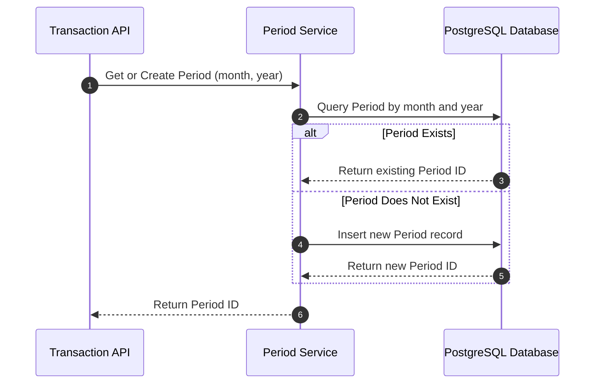

# Accounting Periods

Accounting Periods isolate financial tracking records into discrete, monthly buckets.

## Concepts

* **Period:** A unique combination of a specific month and year (e.g., May 2026).
* **ID Isolation:** All transactions and budgets are associated with a `period_id` to ensure monthly isolation.

---

## Flow and Lifecycle

### Automatic Period Resolution
When transactions are registered, the system resolves the target period dynamically:

---

## Updates and Deletions
Periods can be modified or deleted via their respective endpoints. Deleting a Period cascades and removes all associated transactions and summaries for that period.
