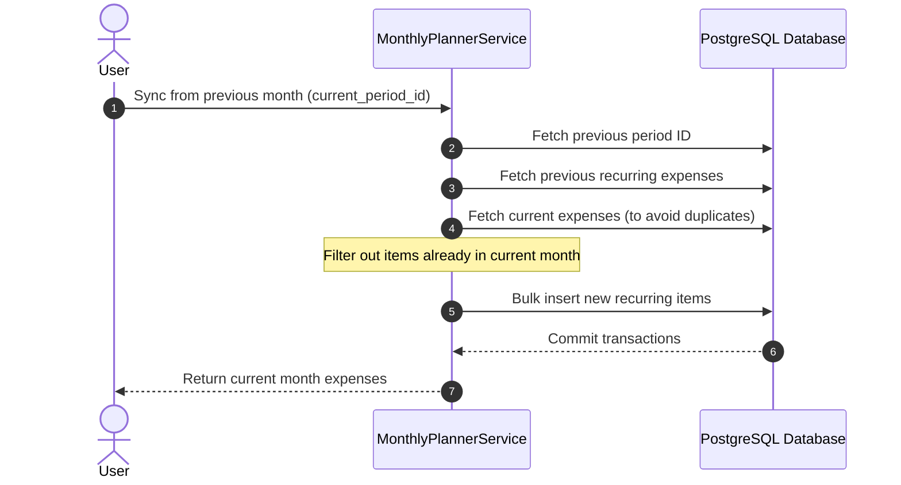

# Monthly Planner & Dashboard

The Monthly Planner helps users plan budgets, categorize expenses, and monitor monthly financial summaries.

## Concepts

* **Expense Item:** Individual planned or actual expenses containing an amount, category, and status (`PENDING` or `COMPLETED`).
* **Custom Categories:** Expense items are classified using structured, two-tier categories (L1 and L2 categories).
* **Summary:** Aggregated dashboard metrics showing total income, total planned expenses, and actual spent.

---

## Key Scenarios

### Syncing Recurring Expenses
To simplify monthly budgeting, users can copy recurring transactions from the previous month.

