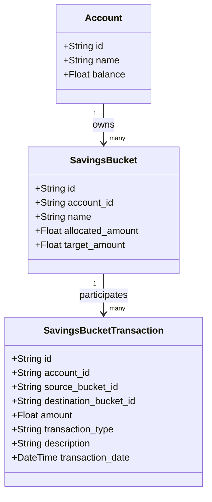
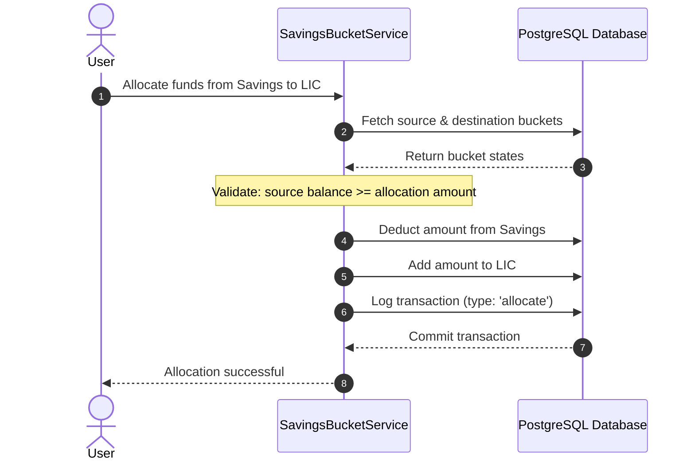
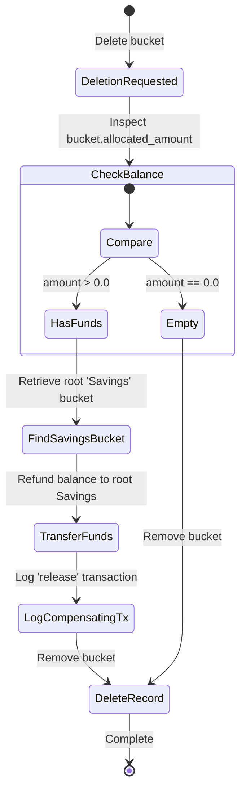

# Savings Buckets & Allocations

The Savings Bucket module manages goal-based sub-allocations of funds within an account. It supports allocating, depositing, and releasing money while maintaining an audited transaction ledger.

---

## Concepts

* **Savings Bucket**: A virtual pool of money within a primary account.
* **Root Bucket (`Savings`)**: The default bucket in every account. It holds all unallocated general funds.
* **Sub-Buckets**: Custom allocations (e.g., `Emergency Fund`, `LIC`) for specific saving goals.
* **Transactions**: State changes (allocation, deposit, release) are recorded in an append-only ledger.

---

## Design and Fund Flows

### 1. Account & Bucket Hierarchy
Each account owns one or more buckets, with the `Savings` bucket acting as the root pool.

---

### 2. Fund Allocation Sequence
When transferring funds from the root `Savings` bucket to a sub-bucket, the service checks balance requirements and records the transaction atomically.

---

### 3. Safe Deletion & Auto-Refund
Deleting a sub-bucket automatically refunds its remaining balance back to the root `Savings` bucket.

---

## Business Rules & Invariants

1. **Root Protection**: The primary `Savings` bucket cannot be renamed or deleted.
2. **Transaction Immutability**: Posted transactions are append-only. There is no edit or delete capability for transaction records.
3. **Double Spend Guard**: Balance modifications are atomic. Allocations exceeding the source bucket balance raise an `InsufficientFunds` error and trigger a rollback.
4. **Cross-Account Isolation**: Transactions cannot move funds between buckets belonging to different accounts.

