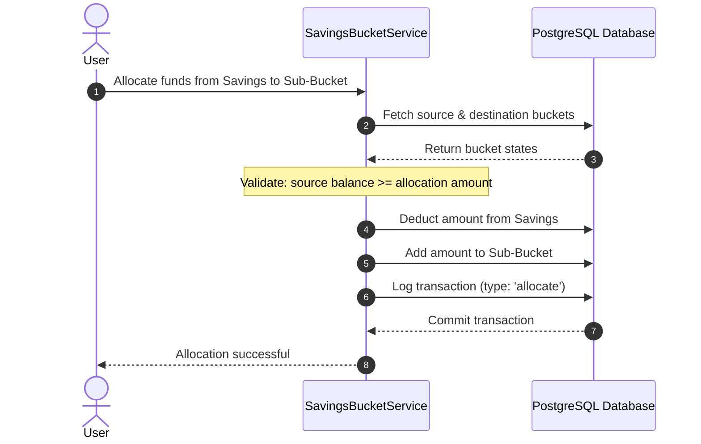
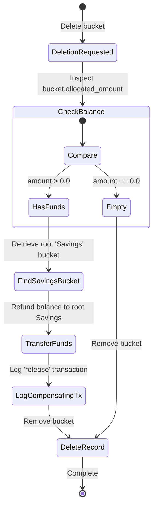
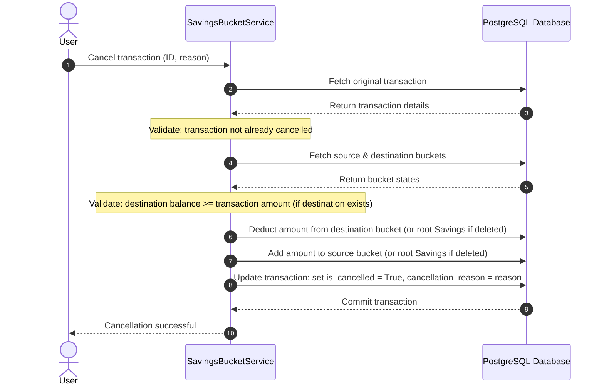

# Savings Buckets & Allocations

The Savings Bucket module manages goal-based sub-allocations of funds within an account.

## Concepts

* **Savings Bucket:** A virtual pool of money within a primary account.
* **Root Bucket (`Savings`):** The default bucket in every account holding unallocated general funds.
* **Sub-Buckets:** Custom allocations (e.g., Emergency Fund) for specific saving goals.
* **Transactions:** State changes (allocation, deposit, release) recorded in an append-only ledger.

---

## Design and Fund Flows

### Fund Allocation
Transferring funds from the root `Savings` bucket to a sub-bucket checks balance requirements and logs the allocation.

---

### Safe Deletion & Auto-Refund
Deleting a sub-bucket automatically refunds its remaining balance back to the root `Savings` bucket.

---

### Transaction Cancellation
Ledger entries can be cancelled by specifying a cancellation reason. Cancelling reverses the adjustments. If target sub-buckets are deleted, it falls back to the root `Savings` bucket.

---

## Business Invariants

1. **Root Protection:** The primary `Savings` bucket cannot be renamed or deleted.
2. **Transaction Immutability:** Posted transactions cannot be edited or deleted. Reversals must be executed via cancellation.
3. **Balance Validation:** Allocations exceeding the source balance raise an `InsufficientFunds` error and trigger a rollback.
4. **Cross-Account Isolation:** Transactions cannot move funds between buckets belonging to different accounts.
