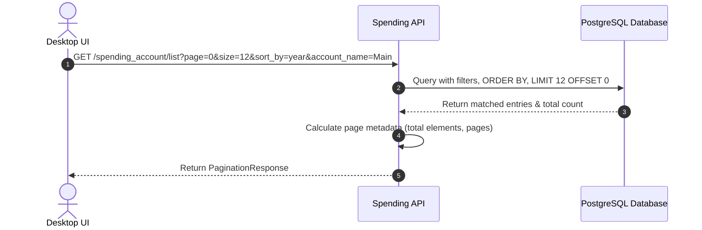

# Spending Entries & Ledger

The Spending Entries and Ledger module tracks transaction inputs, manages account balance calculations, and displays paginated logs.

## Concepts

* **Starting Balance:** The initial balance of the account at the start of the period.
* **Current Balance:** The remaining balance after all expenses.
* **Current Credit:** The total incoming funds or salary credited during the period.
* **Balance After Credit:** Calculated as `current_balance + current_credit`.
* **Total Spent:** Calculated as `starting_balance - current_balance`.

---

## DB-Level Pagination, Sorting, and Filtering

To ensure optimal performance and avoid loading massive datasets into memory, sorting, filtering, and pagination are executed directly in PostgreSQL.

### Pagination
List requests accept `page` (0-indexed) and `size` parameters. The service translates these into SQL `LIMIT` and `OFFSET` queries.

### Sorting
Transactions can be sorted by fields such as `month`, `year`, or `account_name` in either ascending (`asc`) or descending (`desc`) order.

### Filtering
Queries support filtering by account name, specific month, and specific year.
